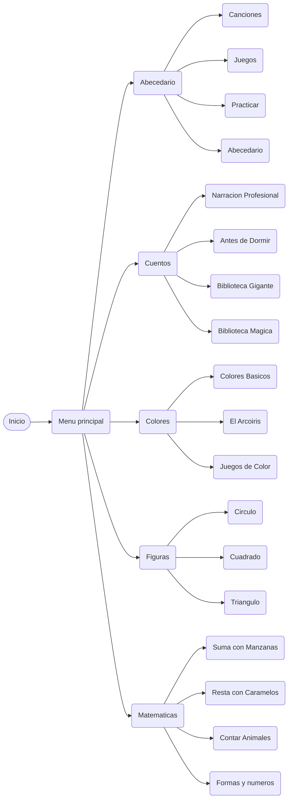

# 🏗️ Arquitectura - Aprende Jugando

## 📊 Diagrama de Flujo de Navegación



---

## 🗂️ Estructura de Carpetas y Responsabilidades

### **Root Level**
| Archivo | Responsabilidad |
|---------|-----------------|
| `index.html` | Página de inicio/portada con CTA principal |
| `.gitignore` | Configuración de control de versiones |
| `README.md` | Documentación general del proyecto |

---

### **`pages/` - Módulos Educativos**
```
pages/
├── menu.html              ← Centro neurálgico: navegación principal
├── abecedario.html        ← Módulo alfabético (A-Z)
├── colores.html           ← Aprendizaje de colores primarios
├── figuras.html           ← Reconocimiento de formas geométricas
├── matematicas.html       ← Números y operaciones básicas
├── cuentos.html           ← Listado y selector de historias
├── biblioteca.html        ← Gestión y búsqueda de cuentos
├── antes_dormir.html      ← Cuentos relajantes especiales
├── ver_cuento.html        ← Visor de cuento individual
├── narracion.html         ← Reproducción con narración
├── ilustraciones.html     ← Galería interactiva
└── construccion.html      ← Placeholder para secciones en desarrollo
```

---

### **`js/` - Lógica de Aplicación**
```
js/

├── cuentos.js
│   ├── Carga de cuentos
│   ├── Reproducción de narración
│   ├── Interactividad (siguiente, anterior, pausa)
│   └── Gestión de progreso
│
├── datos_cuentos.js
│   ├── Array de objetos cuento
│   ├── Estructura: { id, titulo, autor, contenido, categoria, edad }
│   ├── 15+ historias
│   └── Base de datos embebida
│
└── ilustraciones.js
    ├── Carga de galería
    ├── Filtrado por categoría
    ├── Lightbox/modal
    └── Animaciones
```

**Dependencias entre módulos:**
```mermaid
graph LR
    cuentos.js --> datos_cuentos.js
    cuentos.js --> style.css
    ilustraciones.js --> ilustraciones.css
```

---

### **`css/` - Estilos y Layouts**
```
css/
├── style.css              ← Estilos globales y componentes base
│   ├── Variables CSS (colores, fuentes)
│   ├── Clases reutilizables (.pill-button, .screen-container)
│   ├── Animaciones (@keyframes)
│   ├── Responsive (media queries)
│   └── Temas (light, dark si aplica)
│
├── grid-cuatro.css        ← Layout 4 columnas (galería)
├── grid-tres.css          ← Layout 3 columnas (alternativa)
├── biblioteca.css         ← Estilos específicos de biblioteca
├── ilustraciones.css      ← Estilos de galería interactiva
└── narracion.css          ← Estilos de narración y reproducción
```

---

### **`assets/` - Recursos Multimedia**
```
assets/
├── images/                ← PNG, JPG (ilustraciones, íconos)
│   └── imagen-central.png
│
├── videos/                ← MP4, WebM (cuentos animados)
│
└── historias/             ← TXT (textos de cuentos)
    ├── bosque.txt
    ├── colores.txt
    └── viaje.txt
```

---


### **Funciones JavaScript**
```javascript
// Verbos descriptivos
function cargarCuentos() { }
function reproducirNaracion() { }
function cambiarPagina(url) { }
function validarEdad(edad) { }

// Constantes en MAYUSCULA
const EDAD_MINIMA = 3;
const EDAD_MAXIMA = 7;
const RUTA_ASSETS = './assets/';
```


---

## 📡 Comunicación entre Módulos

| Módulo A | → | Módulo B | Método |
|----------|---|----------|--------|
| `main.js` | → | `cuentos.js` | Función import/call |
| `cuentos.js` | ← | `datos_cuentos.js` | Array global acceso |
| `menu.html` | → | `abecedario.html` | Enlaces href |
| `narracion.html` | ← | `cuentos.js` | localStorage/sessionStorage |


---

## 🚀 Performance

- **Sin dependencias npm** → Carga rápida
- **CSS modular** → Tree-shaking posible
- **JS vanilla** → Sin overhead de frameworks
- **Imágenes optimizadas** → Usar WEBP + PNG fallback

---

## 📝 Notas Técnicas

- Usar `const` y `let` (no `var`)
- Funciones puras cuando sea posible
- Comentarios en español para consistencia
- Usar `console.log()` con prefijo: `[Cuentos]`, `[Main]`